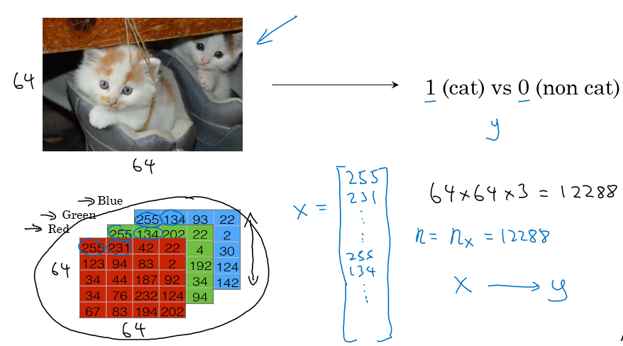
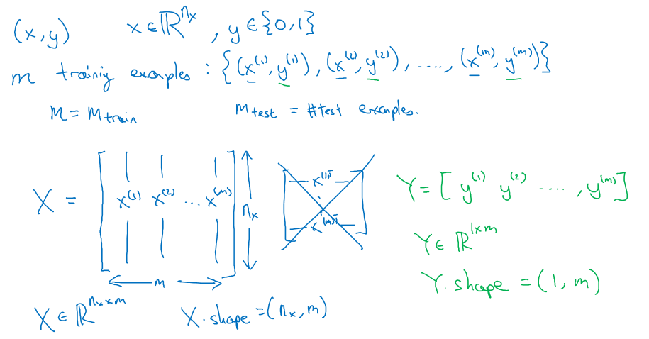
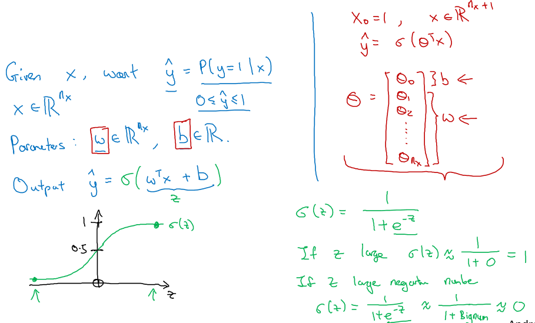
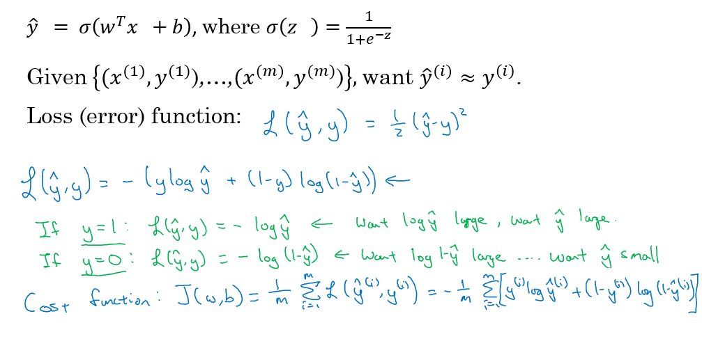
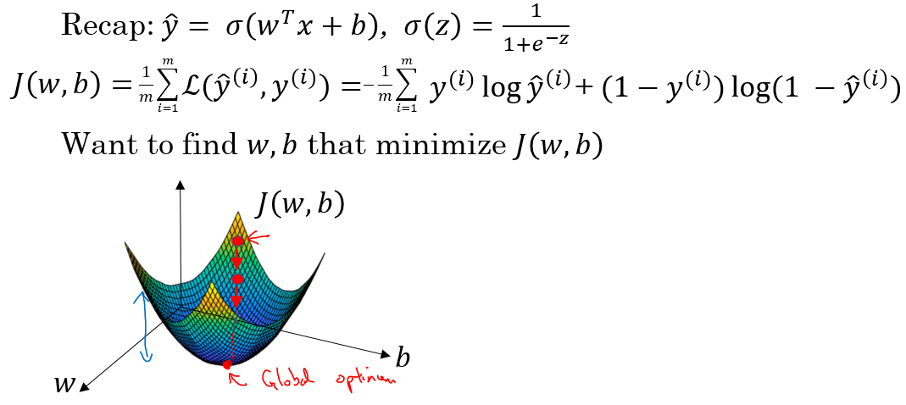
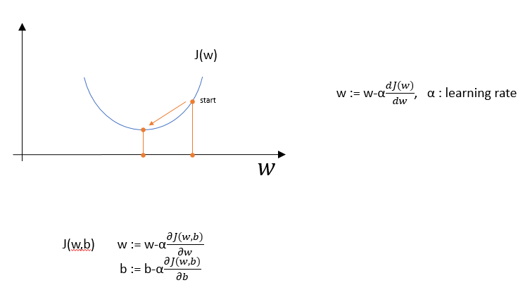
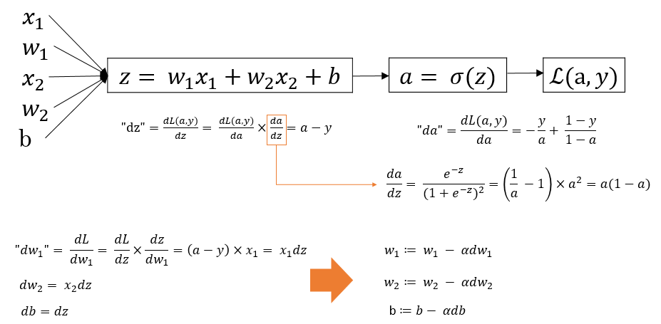
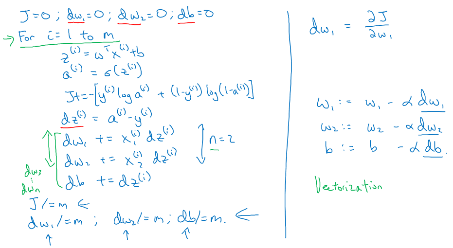
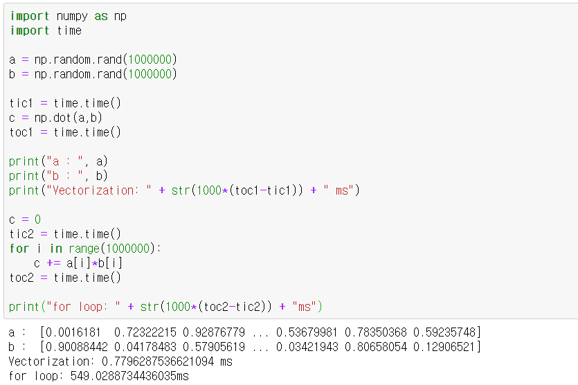

## Binary Classification
  
- 64x64 사이즈의 이미지가 주어졌을 때, RGB로 이루어진 3개의 64x64 행렬로 표현 가능하다.
- input X벡터는 [255,231,...,255,134,...]의 Transpose 형태로 64x64x3개의 원소를 갖는다.
- input값을 통해 y=1 or y=0을 예측하는 것이 이진 분류 방식이다.
## Notation
  
- 학습 데이터의 쌍을 (x,y)라 하며 x는 n_x차원을 갖고 y는 0또는 1값을 갖는다.
- m은 학습 데이터의 개수이며 위첨자 (m)은 m번째 데이터라는 의미이다.
- X는 학습 데이터 input값을 모두 담은 행렬이다. 가로로 쌓는 것이 학습시키기에 유리하다.
- Y는 학습 데이터 output값을 모두 담은 행렬이다. 0 또는 1 값을 갖는다.
## Logistic Regression
  
- x값이 주어졌을 때, y=1일 확률을 계산하는 과정이 필요하며 이 값을 y^ 이라 한다.
- y^을 1차 선형 식으로 `wx+b`와 같이 표현할 수 있고 이 값을 0~1사이로 만들기 위해 활성화함수를 사용한다. 위의 예시는 Sigmoid함수를 적용한 것이다.
- parameter인 w와 b는 나누어 표현하는 것이 좋다. 오른쪽의 표현방법은 w와 b를 한 개의 벡터로 나타낸 것이며 사용하지 않는다.
## Cost Function
  
- Loss function을 정의할 때, `1/2(y^ - y)^2` 으로 한다면 경사하강법 실행 시 local minimun에 빠지기 쉽다.
- 따라서 Loss function은 `-(ylogy^ + (1-y)log(1-y^))`으로 정의한다.
- 손실함수를 작게 만드는 것이 목표이므로, y=1인 경우 y hat값은 커져야 하고 y=0인 경우 y hat값은 작아져야 한다.
- Cost function은 각 학습 데이터의 Loss function을 더한 값이며 `J(w,b)` 로 나타낸다.
## Gradient Descent
  
- `J(w,b)`를 최소화시키는 `w,b`값을 찾는것을 목표로 경사하강법을 사용한다.
  
- w를 `기울기*learning rate` 만큼 뺀 값으로 업데이트하여 local minimun 값을 찾는 방법이다.
- 위의 예시는 w만의 함수일 경우이고, 아래 수식은 b값을 추가적으로 고려한 것이다.
## Logistic Regression에 적용_1개의 example
  
- `x1,w1,x2,w2,b` 값으로 손실함수를 계산하는 과정이다. 초기값을 통해 `L(a,y)`값을 구한 뒤 `dw1,dw2,db` 값을 구해 `w1,w2,b` 값을 업데이트 한다.
- 여기서 사용한 `da, dz, dw1`은 파이썬 코드에서 변수명으로 사용될 Notation이다.
## Logistic Regression에 적용_m개의 example
  
- `J,dw1,dw2,db`의 초기값을 0으로 둔다.
- `z,a,J,dz,dw1,dw2,db`값을 계산한다. 여기서 `J,dw1,dw2,db`는 누적으로 더해지는 값이다.
- 누적으로 더한 값들을 m으로 나눈 후 오른쪽 식을 통해 `w1,w2,b`를 업데이트 한다.
- wn까지 있다고 가정한다면 for문이 2번 필요하게 된다. 이는 대용량의 데이터 처리에 부적합하여 `Vectorization` 과정이 필요하다.
## Vectorization
- 빠른 결과확인을 위해 vectorization을 통해 for문을 제거한다.
- `Z = np.dot(w,x) + b` , `A = sigmoid(Z)`와 같이 Z와 A리스트로 1~m까지의 for문을 줄일 수 있다.
- `dw = np.zeros((nx,1)), dw += x[i]dz[i]`로 dw부분의 for문을 줄일 수 있다.
- 아래 예시는 Vectorization을 적용했을 때와 아닐때의 계산속도 차이를 보여준다. 500배 정도의 차이가 난다.
  

